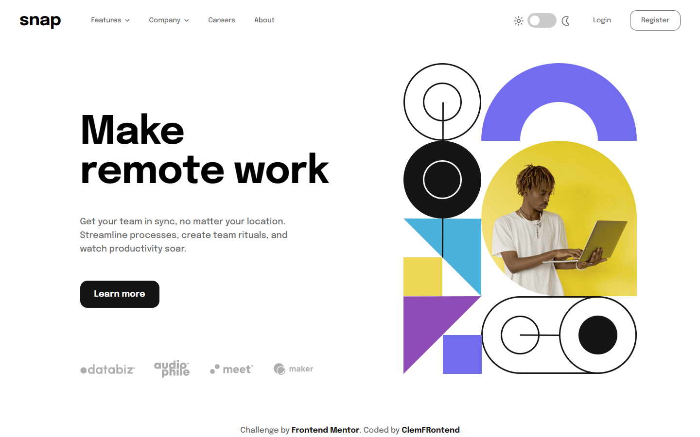

# Frontend Mentor - Interactive card details form solution

This is a solution to the [Intro section with dropdown navigation](https://www.frontendmentor.io/challenges/intro-section-with-dropdown-navigation-ryaPetHE5) 🎉

## Table of contents

- [Overview](#overview)
  - [The challenge](#the-challenge)
  - [In addition](#in-addition)
  - [Result](#result)
  - [Links](#links)
- [My process](#my-process)
  - [Built with](#built-with)
  - [Difficulties](#difficulties)
- [Author](#author)

## Overview

### The challenge

Your challenge is to build out this intro section with dropdown navigation and get it looking as close to the design as possible.

You can use any tools you like to help you complete the challenge. So if you've got something you'd like to practice, feel free to give it a go.

Your users should be able to:

- View the relevant dropdown menus on desktop and mobile when interacting with the navigation links
- View the optimal layout for the content depending on their device's screen size
- See hover states for all interactive elements on the page

### In addition

- I added a feature to toggle the theme (inspired from [Melvin Aguilar](https://www.frontendmentor.io/solutions/intro-section-with-dropdown-navigation-tmQXOQU78e) thks for him) 🚀
- I also implemented React Router and implement an error page. Click on a click to see the result 😎

### Result

### Links

- Solution URL: [See source code](https://github.com/ClemFRontend/intro-section-with-dropdown-navigation)
- Live Site URL: [intro-section-with-dropdown-navigation-pi-eight.vercel.app](https://intro-section-with-dropdown-navigation-pi-eight.vercel.app/)

## My process

### Built with

- ⚛️ [React](https://reactjs.org/) - JS library

### Difficulties

This is things that was very difficult to me :

- The most difficault thing was to make the dropdown menu responsive. I have never done burger menu in the past and I have succeeded to make it and more, I make it responsive. It was a really challenge for me and I'm very glad of the result. The code can be probably improval but the result is here 🥳
- The theme toggle was more easly to implement than I thought and the result is very cool 😎

## Author

- Frontend Mentor - [@ClemFRontend](https://www.frontendmentor.io/profile/ClemFRontend)
